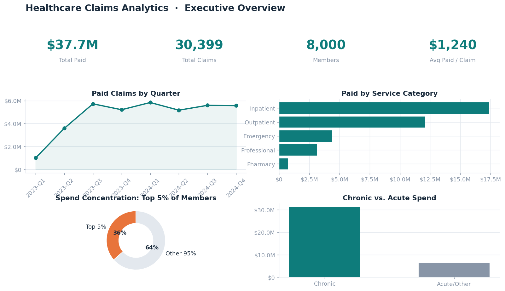
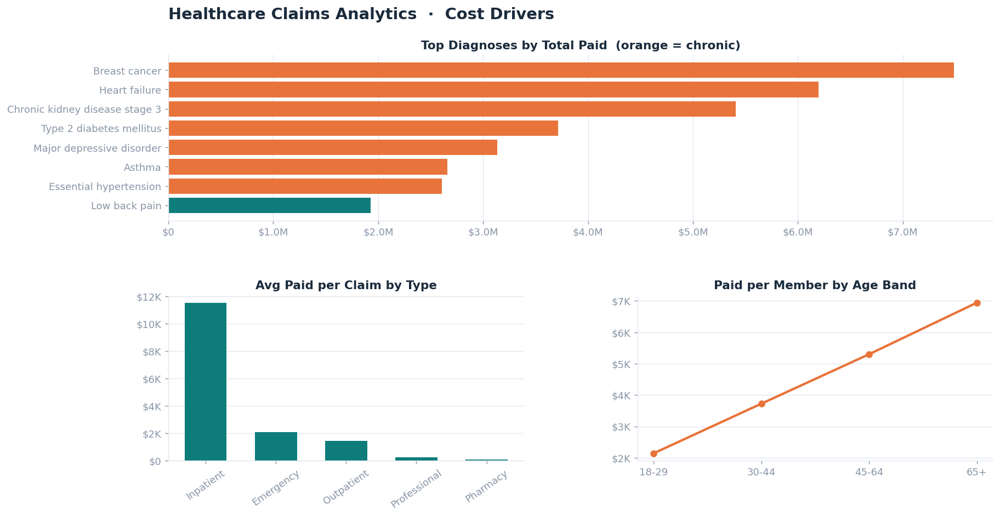
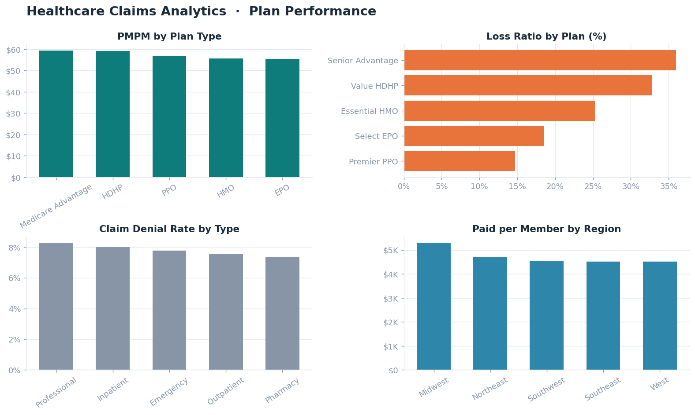

# Healthcare Claims Analytics

End-to-end analytics project on a synthetic health-insurance claims dataset:
data modeling, SQL analysis, and an executive dashboard that surfaces what
actually drives medical spend.

**Stack:** Python · SQL (DuckDB / standard SQL) · pandas · matplotlib

---

## TL;DR — what the data shows

- **$37.7M** in paid claims across **30,399 claims** and **8,000 members**.
- **The top 5% of members account for 36% of all spending** — textbook cost concentration, and the single most important lever for any care-management program.
- **Chronic conditions drive 83% of total paid** ($31.2M of $37.7M) despite being a minority of diagnoses. Average chronic claim costs **$1,734 vs. $523** for acute care.
- **Inpatient care is 46% of spend on just 5% of claim volume** — 1,512 inpatient claims at an average of **$11,504** each.
- **Spend scales steeply with age:** ~$2,144 paid per member for ages 18–29 vs. **$6,944 for 65+**.
- **Medicare Advantage carries the highest cost** (PMPM of **$59.37** and a 36% loss ratio); the PPO book runs leanest at a 14.7% loss ratio.

---

## Dashboard

### Executive Overview


### Cost Drivers


### Plan Performance


---

## Data model (star schema)

A single fact table (`claims`) surrounded by four conformed dimensions:

```
                 ┌─────────────┐
                 │   members   │
                 └──────┬──────┘
   ┌────────────┐       │        ┌─────────────┐
   │   plans    │───┐    │    ┌───│  providers  │
   └────────────┘   │    │    │   └─────────────┘
                  ┌──┴────┴────┴──┐
                  │    claims     │  ← fact
                  └───────┬───────┘
                  ┌───────┴───────┐
                  │   diagnoses   │
                  └───────────────┘
```

| Table | Grain | Key columns |
|-------|-------|-------------|
| `claims` | one row per claim line | `claim_id`, `member_id`, `provider_id`, `diagnosis_code`, `claim_type`, `billed/allowed/paid_amount`, `claim_status` |
| `members` | one row per member | `member_id`, `age`, `gender`, `region`, `plan_id`, `enrollment_date` |
| `providers` | one row per provider | `provider_id`, `specialty`, `region` |
| `plans` | one row per plan | `plan_id`, `plan_type`, `monthly_premium` |
| `diagnoses` | one row per diagnosis code | `diagnosis_code`, `description`, `chronic_flag` |

The dataset is **fully synthetic and reproducible** — generated with a seeded
Python script (`data/generate_data.py`). No real patient data is used.

---

## Business questions answered

The SQL in `sql/02_analysis_queries.sql` answers twelve questions, including:

1. **PMPM (per member per month) cost by plan type**
2. Cost concentration — what share of spend comes from the top 5% of members
3. Provider cost ranking
4. Quarterly cost trend
5. Spend by service category (inpatient / outpatient / pharmacy / etc.)
6. Chronic vs. acute cost comparison
7. Top diagnoses by total paid
8. Claim denial rates by service category
9. Cost by member age band
10. Regional cost variation
11. Contractual discount (paid-to-billed ratio) by claim type
12. Plan-level loss ratio (claims paid vs. premium revenue)

---

## How to run

```bash
# 1. Install dependencies
pip install faker pandas numpy matplotlib duckdb

# 2. Generate the synthetic dataset (writes CSVs into data/)
cd data && python generate_data.py && cd ..

# 3. (Optional) run the SQL analysis against the CSVs with DuckDB
#    duckdb lets you query the CSVs directly — no load step required.

# 4. Build the dashboard PNGs (writes into images/)
cd analysis && python dashboard.py
```

---

## Repository structure

```
healthcare-claims-analytics/
├── README.md
├── data/
│   ├── generate_data.py        # seeded synthetic data generator
│   ├── members.csv
│   ├── providers.csv
│   ├── plans.csv
│   ├── diagnoses.csv
│   └── claims.csv
├── sql/
│   ├── 01_schema.sql           # star-schema DDL
│   └── 02_analysis_queries.sql # 12 analytical queries
├── analysis/
│   └── dashboard.py            # builds the three dashboard pages
└── images/
    ├── dashboard_executive_overview.png
    ├── dashboard_cost_drivers.png
    └── dashboard_plan_performance.png
```

---

## Notes & caveats

- All figures come from synthetic data and are for demonstration only — they
  illustrate analytical method, not real population health.
- Cost distributions were intentionally modeled with a small high-utilizer
  cohort and a chronic-condition cost premium so the concentration and
  chronic-spend patterns mirror what is typically seen in real claims data.
